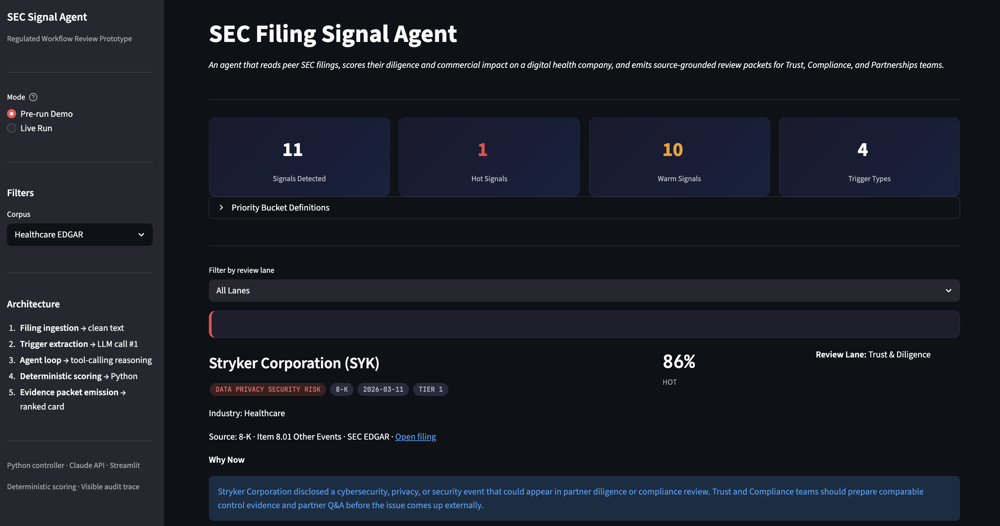
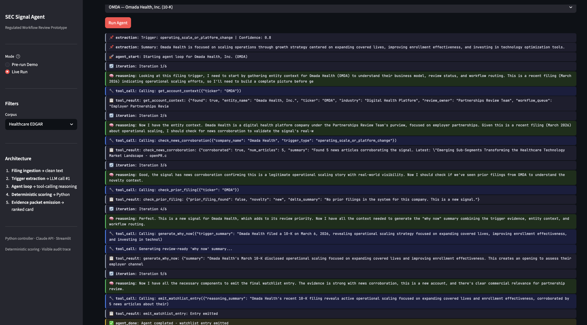
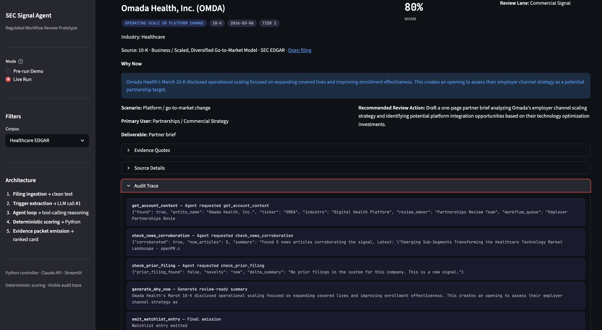

# SEC Signal Agent - Prototype

An agentic workflow prototype that reads verified public EDGAR excerpts and turns operationally significant disclosures into evidence-grounded review packets.

The public version is framed as a healthcare commercial, partnerships, strategy, operations, trust/security, and compliance review queue. It demonstrates a transferable regulated-workflow pattern: signal extraction, deterministic scoring and routing, evidence validation, human-review gates, and audit traces.

## Demo Preview

The app ships with a pre-run review queue for fast evaluation without API keys, and a live run mode that shows the agent loop, tool calls, and audit trail.

### Ranked Review Queue



### Live Agent Loop



### Evidence Packet and Audit Trace



## Why It Matters

Regulated operations teams often need to notice material changes buried in long, language-heavy source documents. This prototype shows a practical AI-builder pattern for that work: use an LLM to extract and synthesize evidence, then use deterministic code to control scoring, routing, fallbacks, and review gates.

The output is a ranked review queue, not an autonomous decision.

## Who Uses This

This prototype is designed for a commercial operations, partnerships, or strategy team monitoring public healthcare-market signals. The user is not a clinician and the system does not make care decisions.

The workflow is:

1. Monitor a curated universe of public companies, with a healthcare EDGAR core available by default.
2. Extract material signals from local pre-parsed SEC excerpts.
3. Classify the signal into a compact trigger taxonomy.
4. Score urgency with deterministic controls.
5. Assign the item to one of two human-owned review lanes.
6. Provide source-grounded evidence and a recommended review action.

## Data Provenance

This repository uses a hand-curated local corpus of short, pre-parsed public EDGAR excerpts. The primary demo view focuses on healthcare and healthcare-adjacent companies, while verified cross-industry examples show that the architecture generalizes beyond one sector.

The prototype does not implement a full SEC HTML/XBRL parser. That was an intentional scope decision so the demo could focus on the AI workflow layer: signal extraction, deterministic scoring/routing, evidence validation, review queue generation, and audit trace.

The filing excerpts and filing metadata are sourced from public EDGAR records. The relationship and review-context metadata is synthetic: review owners, relationship status, strategic relevance notes, and queue examples are included only to demonstrate how a signal would land in a human-owned operating workflow.

System outputs such as trigger classification, priority score, review lane, evidence packet, and audit trace are generated by the prototype from the local source text and synthetic review context. Evidence quotes in generated outputs are validated against the local source text.

The repository does not contain employer data, credentials, production data, private PHI, patient-level records, diagnosis, treatment recommendations, medication recommendations, cardiac prediction, or autonomous clinical decisions.

## Corpus Segments

- **Healthcare EDGAR core:** verified public EDGAR excerpts from healthcare and healthcare-adjacent public companies.
- **Cross-industry EDGAR examples:** verified public EDGAR excerpts that demonstrate the pattern beyond healthcare.

All active demo items are verified public EDGAR excerpts. Each source record includes filing metadata such as company, ticker, CIK, form type, filing date, accession number, filing section, and SEC source URL.

## Trigger Taxonomy

The public demo uses four compact trigger categories:

- `regulatory_compliance_pressure`
- `data_privacy_security_risk`
- `operating_scale_or_platform_change`
- `reimbursement_or_commercial_model_pressure`

## Review Lanes

| Lane | Primary user | Job to be done | CTA | Deliverable |
| --- | --- | --- | --- | --- |
| Trust & Diligence | Trust/Security, Compliance, Quality reviewer | Stay ahead of partner diligence questions sparked by peer disclosures | Prepare diligence packet | 1-page packet with peer event summary, equivalent control posture placeholder, suggested Q&A |
| Commercial Signal | Partnerships, Commercial Strategy | Spot account openings from prospect filings | Generate partner brief | 1-page brief with trigger, account context, suggested outreach angle, draft message |

## Priority Buckets

| Bucket | Meaning | Action |
| --- | --- | --- |
| Hot | High-confidence, high-urgency item | Produce the lane-specific packet or brief this week |
| Warm | Relevant item with useful evidence | Review in weekly planning or corroborate with account context |
| Monitor | Weak, early, or lower-priority item | Track but do not produce a deliverable yet |
| Skip | Not actionable for the active workflow | Exclude from the default review queue |

## Architecture

```text
Filing excerpt -> Trigger Extractor -> Agent Loop -> Evidence Packet
                                      |
                         +------------+------------+
                         |            |            |
                    entity context  scoring   review-lane routing
                         |            |            |
                         +------------+------------+
                                      |
                            Ranked Review Queue
```

The key pattern is LLM-assisted language analysis inside a bounded agent loop, with Python enforcing evidence grounding, routing, scoring, and auditability.

- **Python is the controller.** It loads filing excerpts, calls tools, validates outputs, computes scores, and emits structured packets.
- **The LLM handles language reasoning.** It extracts trigger candidates and synthesizes review-ready rationale from filing text.
- **The agent loop is tool-based.** The workflow assembles each packet through discrete steps: source loading, synthetic context lookup, trigger extraction, review-lane routing, deterministic scoring, Why Now generation, and packet emission.
- **Scoring is deterministic.** The LLM does not compute final priority scores or bucket assignments.
- **Review-lane routing is deterministic.** Items collapse into Trust & Diligence or Commercial Signal using explicit rules and synthetic relationship/review context.
- **Evidence is validated.** Output quotes are checked against the local excerpt text.
- **Execution is auditable.** Each card shows the tool path used to produce the packet.

## Demo / Sample Output

The app ships with pre-computed evidence packets in `demo_outputs/prerun_watchlist.json`. The Streamlit dashboard displays these without requiring a live LLM call. Use **Pre-run Demo** mode in the sidebar.

A typical evidence packet includes:

- company, filing type, filing section, and SEC source link;
- trigger category and priority bucket;
- review lane and primary user;
- deliverable type and recommended review action;
- source-grounded evidence quote;
- Why Now rationale;
- audit trace showing the tool path used to generate the packet.

## Project Structure

```text
├── app.py                       # Streamlit dashboard
├── agent.py                     # Python-controlled agent loop
├── tools.py                     # Tool implementations
├── schemas.py                   # Pydantic typed schemas
├── scoring.py                   # Deterministic priority scoring
├── product_mapping.py           # Deterministic review-lane routing; legacy filename
├── filing_loader.py             # Load excerpt text and metadata
├── trigger_extractor.py         # Filing excerpt -> trigger JSON
├── prompts.py                   # LLM prompts
├── demo_runner.py               # CLI demo runner
├── data/
│   ├── filings_manifest.csv
│   ├── filings/clean_text/      # Verified pre-parsed public EDGAR excerpts
│   ├── prototype_accounts.xlsx  # Synthetic entity context
│   └── prototype_workflows.xlsx # Synthetic workflow context
├── demo_outputs/
│   └── prerun_watchlist.json    # Pre-computed evidence packets
├── DEMO_SCRIPT.md
├── PRODUCTION_NEXT_STEPS.md
└── requirements.txt
```

## How To Run

```bash
pip install -r requirements.txt
streamlit run app.py
```

For live LLM runs, set a Claude credential:

```bash
export ANTHROPIC_API_KEY=your_api_key_here
```

Refresh the pre-run output:

```bash
python demo_runner.py --all
```

## Deterministic Checks

The LLM is used for language extraction and synthesis. Final workflow controls remain deterministic in Python: priority scoring, review-lane routing, packet schema validation, and evidence quote checks.

A minimal pytest suite covers the core non-LLM controls:
- scoring bucket assignment;
- review-lane routing;
- pre-run demo packet shape;
- source provenance fields;
- exact evidence quote matching against local filing excerpts.

Run:

```bash
python -m pytest
```

## Design Decisions

| Decision | Rationale |
| --- | --- |
| Pre-parsed local EDGAR excerpts | Keeps the portfolio demo focused on the AI workflow layer rather than SEC parser engineering. |
| Python controller | Keeps orchestration, fallbacks, and tool execution debuggable. |
| Deterministic scoring and routing | Keeps priority and review-queue behavior explainable, stable, and auditable. |
| Human-review queue | The system supports reviewers; it does not make autonomous operational or care decisions. |
| Synthetic relationship/review context | Demonstrates enrichment and routing without private systems or production data. |

## Limitations

- In pre-run demo mode, Why Now copy uses deterministic lane templates for reproducibility and cost control. Live mode can generate more filing-specific narratives while preserving the same evidence, scoring, and routing controls.
- The prototype does not implement full SEC HTML/XBRL parsing.
- The enrichment workbooks contain synthetic relationship and review-context metadata; they do not represent private systems.
- The app is not production-deployed and does not include full monitoring, auth, observability, reviewer disposition capture, or evaluation infrastructure.
- Some internal module names remain from the original prototype for compatibility, but public-facing output is framed around review lanes, evidence packets, and human-owned workflows.

## License and Usage

This repository is a public portfolio/demo project. It is shared for review and discussion, not as production software.

No formal open-source license is granted at this time. The code, prompts, synthetic workflow context, and dashboard design remain owned by the author unless otherwise stated.

The EDGAR filing excerpts are sourced from public SEC filings. The prototype does not provide legal, financial, clinical, diagnostic, or treatment advice and should not be used for production decision-making without further validation, security review, and governance.

## What I Would Build Next

- Add a robust SEC parser with section extraction and XBRL handling.
- Add an evaluation set for trigger extraction, evidence matching, abstention, and routing accuracy.
- Add reviewer disposition capture so scoring weights can be calibrated against human feedback.
- Add queue-based processing, retries, structured logs, prompt/version tracking, and cost observability.
